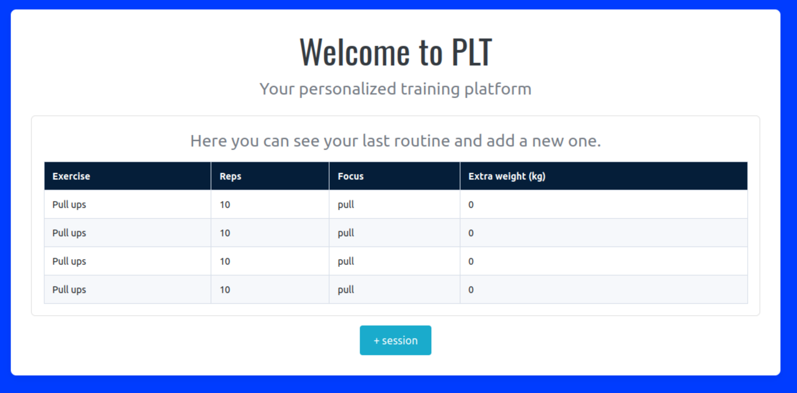
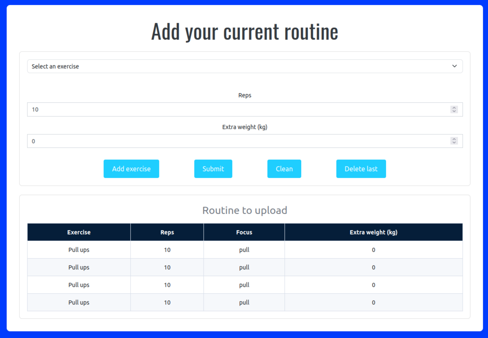

# PLT_calisthenics
Develop a personal load tracker only registering calisthenics exercises just like pull ups, dips or muscle ups


## 1. Clone repo

- With HTTPs

```shell
    git clone https://github.com/BQC21/PLT_calisthenics.git
```

- With SSH

```shell
    git clone git@github.com:BQC21/PLT_calisthenics.git
```

## 2. Initialize
```shell
    npm init
```

## 3. Run 
``` shell
    npm run dev
```

## 4. Put on your browser http://localhost:5173/

Go to `+session` button to update your current routine


Then select your exercise, put your reps and if you have incorporated extra weight, otherwise the last one take its default value (0 kg). Click on `Add exercise` to build your table routine.

Manage your routine with these options:
* `Clean` -> empty your entire data routine 
* `Delete last` -> only erase the last row added

When you have finished, click on `Submit`. Check on Home page to see updates.

### Learnings:
* Create a navbar using routing techniques with `react-router-dom`
* Adding a image background with CSS
* Adding responsive media style

### Pendings:
* Add authentication (Login, Register)
* Add localStorage to save past routines